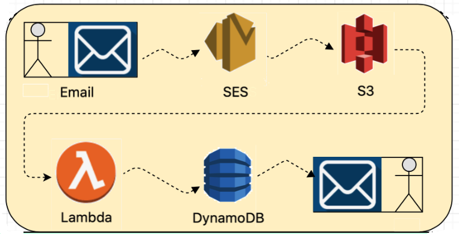

# Badger

<p align="center">
    </img>
</p>

|[Need / Purpose](#need--purpose)|[Design Considerations](#design-considerations)|[Admin / Reviewer actions](#admin--reviewer-actions)|[User actions](#user-actions)|[Support](#Support)|
|---|---|---|---|---|
|   |[Workflow Architecture](#workflow-architecture)|[Add a Badge](#add-a-badge)|[Apply for a Badge](#apply-for-a-badge)|   |
|   |[Major functional workflow](#major-functional-workflow)|[Add Reviewers to a Badge](#add-reviewers-to-a-badge)|[Backpack](#backpack)|   |
|   |   |[Award Badge](#award-badge)|[Forget a Badge](#forget-a-badge)|   |
|   |   |[Rework](#rework)|[Forget ALL Badges](#forget-all-badges)|   |
|   |   |[Delete a Badge](#delete-a-badge)|[Verify a Badge](#verify-a-badge)|   |
|   |   |[Modify a Badge](#modify-a-badge)|   |   |
|   |   |[Get all Badges](#get-all-badges)|   |   |
|   |   |[Get all Assertions](#get-all-assertions)|   |   |

## Need / Purpose
Badger is primarily intended for internal DXC employees.  However, there exists a business use case wherein external people might be awarded DXC branded badges, for instance, after attending an technical bootcamp or event.  For such a scenario, we need a badging system which is independent of the internal DXC employees-only app.

## Design considerations
The primary design consideration I have tried to implement is S3: simple, secure and scalable.  System has to be simple enough for both technical as well as non-technical users, secure and should be scalable at enterprise level.  Further the system should allow easy integration with any other system.  To satisy all these aspects, the HCI (Human Computer Interaction) interface has been chosen as email.

1. No website. No GUI. No User-ID. No Password.  We want to ensure any hacking potential is absolutely minimal, and also that the system is not burdened with user credential management.

2. Completely isolated from the internal DXC employees-only Badger instance, with the AWS stack being different.

3. Three types of functional users: Admin, Reviewer and User.  All interact with the system via email to invoke micro-services.

4. Only a small number of authorized Admins and Reviewers with a registered DXC email-id can invoke Admin functions via email.    Admins can invoke all the Admin functions.  A Reviewer can also invoke Admin Functions, except three - Adding a Badge / Adding additional Reviewers to a Badge / Delete a Badge.   Only DXC employees can be an Admin or a Reviewer.  <i>For better control on critical access, Admins can only be added by the product owner.  To be added as an admin, please drop a note to [vsivasubram3@dxc.com](mailto:vsivasubram3@dxc.com).</i> Admins can add additional reviewers either during a Badge creation or later on via "[Add Reviewers to a badge](#add-reviewers-to-a-badge)".

5. To be GDPR compliant, no other PII (Personally Identifiable Information) is collected and stored in the system, apart from the email-id of the Admins and Reviewers.  For Users, email-id and name is captured.

6. One S3 bucket to hold badge images.  This S3 bucket is private and does NOT have any public bucket/IAM/ACL policies.

7. One DynamoDB table with flexible schema.

8. Database table schema for "Badge" item:

    |Field|Attribute|
    |---|---|
    |pk|UUID|
    |sk|"Badge"|
    |badge_name|\<string\>|
    |badge_name_lower|\<string\>|
    |badge_description|\<string\>|
    |badge_id|\<S3 bucket item id concatenated with badge image filename\>|
    |owner|\<Email-id\>|
    |created|\<DateTimestamp\>|
    |reviewers|\<list of comma separated email-ids\'\>|
    |assertions_count|\<int\>|
    |users|\<list of comma separated email-ids\'\>|
    |deleted_flag|\"Yes\" or \"No\"|
    |deleted_on|\<DateTimestamp\> or null|
  
9. Database table schema for "Assertion" item:

    |Field|Attribute|
    |---|---|
    |pk|UUID|
    |sk|"Assertion"|
    |email_id|\<Email-id\>|
    |name|\<string\>|
    |evidence|\<string\>|
    |badge_id|\<S3 bucket item id concatenated with badge image filename\>|
    |badge_name|\<string\>|
    |badge_owner|\<string\>|
    |reviewers|\<Email-id\>|
    |status|\"Applied\" or \"Rework\" or \"Awarded\"|
    |applied_on|\<DateTimestamp\>|
    |awarded_on|\<DateTimestamp\>|
    |awarded_by|\<Email-id\>|
    |rework_by|\<list of comma separated email-ids\>|
    |rework_on|\<list of comma separated DateTimestamp\>|
    |rework_commas|\<list of comma separated rework comments\>|
    |deleted_flag|\"Yes\" or \"No\"|
    |deleted_on|\<DateTimestamp\> or null|
    |time_to_erase|<time>|
  
10. Database table schema for Admin or Reviewer item:

    |Field|Attribute|
    |---|---|
    |pk|UUID|
    |sk|"Admin" or "Reviewer"|
    |email_id|\<Email-id\>|

<a href="#badger-external"></img></a>

### Workflow Architecture

<p align="center">
       
</p>

Interactions with the system are completely via email.  The system is completed hosted on AWS.  An email request sent to a specific email address invokes a SES (Simple Email Service) action, which stores the email in a S3 bucket.  This in turn triggers an associated Lambda action.  The Lambda function retrieves / stores appropriate data from / to a DynamoDB table and sends back an email response to the original requestor.

<a href="#badger-external"></img></a>

### Major functional workflow

<p align="center">
     
</p>

<a href="#badger-external"></img></a>

## Admin / Reviewer actions

### Add a Badge
* An admin sends an email to "add-badge@badger.services" with the following information:
    - Subject: Add a Badge
    - Attachment: Badge image confirming to DXC standards as detailed in "Badge Design" section [here](https://my.dxc.com/employee-resources/global-learning-and-development/DXCBadges.html).
    - Body of the email should have:
        - Name: <Name of the Badge>
        - Description: <Description of the Badge>
        - Reviewers: <List of comma separated <b>DXC</b> email-ids' of reviewers <b>ending with a semicolon ";"</b>>
          <br /><i>( for example: </i>vsivasubram3@dxc.com, tlhotak@dxc.com, rpetrova@dxc.com; <i>)</i>
          <br />- if there are no reviewers to be added to the badge at this time leave the field as <b>Reviwers:;</b>
        
* On successful validation, the Badge details are stored in the system with the admin who sent the request email as <i>Badge Owner</i>.  A notification email is sent to the Badge Owner and Reviewers (if any, as "Cc") along with the badge image as attachment.

* A sample request email is [here](images/add-badge-request.png) and a sample system response email is [here](images/add-badge-response.png).

<a href="#badger-external"></img></a>

### Add Reviewers to a Badge
* In cases where reviewers have to be added after the intial creation of the badge, an Admin, who is the owner of the Badge, sends an email to "add-reviewers@badger.services" with the subject having Badge Name and in the body of the message a list of comma separated email-ids' <b>ending with a semicolon ";"</b>.  
    
* On successful completion, the requesting Admin with Reviewers in "Cc" will be notified via email.

* A sample request email is [here](images/add-reviewers-request.png) and a sample system response email is [here](images/add-reviewers-response.png).

<a href="#badger-external"></img></a>

### Award Badge
* Once an user applies for a Badge (as [below](#apply-for-a-badge)), the system will trigger an automated email alert to the Badge Owner with "Cc" to Reviewers.  The email has two action buttons: "Award Badge" and "Rework needed".

* If either the Badge Owner or one of the Reviewer is satisfied with the evidence provided by the user and wishes to award the Badge, he or she clicks the "Award Badge" button.  A new email will open, with prepopulated information like subject line having the Badge Id and User email-id, which has the approver needs to send (<i>from his / her DXC account only and without changing the subject line</i>).
    
* On success, user who applied for the Badge will receive notification email with a Badge image having the following metadata:

```
Badge "<badge_name>" has been issued to "<user email_id>" on "<awarded_date>".
```

* A sample first automated email from system is [here](images/apply-badge-response-admin.png).  A sample prepopulated award badge email sent by Badge Owner or Reviewer is [here](images/award-badge-request.png) and a sample Badge award confirmation email is [here](images/award-badge-response-user.png).

<a href="#badger-external"></img></a>

### Rework
* Once an user applies for a Badge (as [below](#apply-for-a-badge)), the system will trigger an automated email alert to the Badge Owner with "Cc" to Reviewers.  The email has two action buttons: "Award Badge" and "Rework needed".

* If either the Badge Owner or one of the Reviewer is not satisfied with the evidence provided by the user, he or she should clicks the "Rework needed" button.  A new email will open, with prepopulated information like subject line having the Badge Id and User email-id.  The reviewer has to put his/her comments in the placeholder in the body of the email and send (<i>from his / her DXC account only and without changing the subject line</i>).  The system will store the rework comments along with the reviewer email-id and date-timestamp in the system.

* User addresses the rework issue and has to reapply for the Badge (same as in "Apply for a Badge" [below](#apply-for-a-badge)).

* A sample first automated email from system is [here](images/apply-badge-response-admin.png).  A sample initial rework email created by system is [here](images/rework-badge-request-initial.png) and the one sent by Badge Owner or Reviewer is [here](images/rework-badge-request-admin.png).

<a href="#badger-external"></img></a>

### Delete a Badge
* An Admin, who is the owner of the Badge, sends an email to "delete-badge@badger.services" with the subject having the Badge Name.  
    
* On successful validation, the Badge and associated Assertions in the DynamoDB table are soft deleted, i.e., the "deleted_flag" is set to "Yes" along with date-timestamp in the "deleted_on" field.
    
* The system will send an email to the requesting Admin with the deleted badge details.  An email is also sent to each individual user informing them that the DXC Badge has been deleted, to remove any references to it and to refrain from using the Badge going forward.

* A sample email from an Admin to delete a Badge is [here](images/delete-badge-request.png).  Sample response email from the system to the requesting Admin is [here](images/delete-badge-response-admin.png) and to Users is [here](images/delete-badge-response-user.png).

<a href="#badger-external"></img></a>

### Modify a Badge
* This is a two-step process.  First, the owner of badge deletes the current badge (as [above](#delete-a-badge)) and then adds a new badge (as [above](#add-a-badge)).

### Get all Badges
* An authorized Admin sends an email to "get-all-badges@badger.services".  The system would email back the requestor with information of all the Badges in the system along with an Excel attachment having all the details.

### Get all Assertions
* An authorized Admin sends an email to "get-all-assertions@badger.services".  The system would email back the requestor with information of all the Assertions in the system along with an Excel attachment having all the details.

<a href="#badger-external"></img></a>

## User actions

### Apply for a Badge
* An user wishing to apply for a DXC Badge sends an email to "apply-for-badge@badger.services" with the subject having the Badge name and body of the email having the word "Evidence:" followed by the evidence link <b>ending with a semicolon ";"</b> like:
    - Evidence: https://colab.research.google.com/notebooks/bigquery.ipynb;
    
* On success, system will email back the User with a confirmation email having the applied Badge details.  The system will also initiate another automated email to the Badge Owner, with Reviewers in "Cc", about the application and to take further action (either award the badge or inform user rework is needed).

* A sample user request email is [here](images/apply-badge-request.png).  The sample response email to user is [here](images/apply-badge-response-user.png) and Admin / Reviewers is [here](images/apply-badge-response-admin.png).

<a href="#badger-external"></img></a>

### Backpack
* An user sends an email to "backpack@badger.services".  On successful validation, all the Assertions associated with the requestor's email-id will be emailed back to the user.  The Badge images are attached along with metadata information.  If a Badge has been "Awarded", the metadata information is 

```
Badge "<badge_name>" has been issued to "<user email_id>" on "<awarded_date>".
```

If an Assertion status is "Applied or "Rework", the metadata information will be

```
Badge "<badge_name>" has been applied by "<user email_id>" on "<applied_date>" which is being 
reviewed by DXC.
```

<a href="#badger-external"></img></a>

### Forget a Badge
* To be compliant to GDPR guidelines, if an user wants to remove his/her Badge, they send an email to "forget-badge@badger.services" with the subject of the email having the Badge Name to be removed.  On successful validations, the badge will marked for <b><i>hard delete (not recoverable) after seven days</i></b>.  If user changes their decision to forget the badge, s/he has to inform the badge owner <b><i>within seven days</i></b>, so that the badge owner can inform the [system administrator](vsivasubram3@dxc.com) to retain the badge.  An email notification to user, with "Cc" having all associated Badge owners, will be sent.  After seven days, all the data associated with the user in DynamoDB table will be hard deleted (not recoverable).    

* A sample request email from user is [here](images/forget-badge-request.png) and a sample response email from system is [here](images/forget-badge-response.png).

### Forget ALL Badges
* To be compliant to GDPR guidelines, if an user wants to be permanently removed from the Badger system, he/she sends an email to "forget-all-badges@badger.services".  On successful validations, the badge will marked for <b><i>hard delete (not recoverable) after seven days</i></b>.  If user changes their decision to forget the badge, s/he has to inform the badge owner <b><i>within seven days</i></b>, so that the badge owner can inform the [system administrator](vsivasubram3@dxc.com) to retain the badge.  An email notification to user, with "Cc" having all associated Badge owners, will be sent.  After seven days, all the data associated with the user in DynamoDB table will be hard deleted (not recoverable).

* A sample request email from user is [here](images/forget-all-badges-request.png) and a sample response email from system is [here](images/forget-all-badges-response.png).

### Verify a Badge
* Anyone intending to verify a Badge can send an email to "verify-badge@badger.services".  Subject of the email should be of the format:
```
badge_name || user email-id

For example, Create a Data Story || vaidya@outlook.com
(for verifying whether "vaidya@outlook.com" has received the badge "Create a Data Story")
```

* On successful verification, a confirmation email to requestor will be sent by the system.

* A sample request email is [here](images/verify-badge-request.png) and a sample system response email is [here](images/verify-badge-response.png).

<a href="#badger-external"></img></a>

## Support
For any support, please drop an email to [Vaidyanathan Sivasubramanian](svaidyan_signup@hotmail.com).
